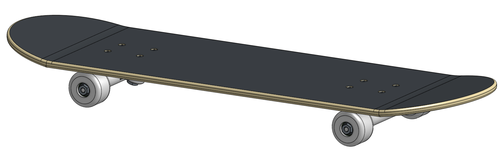
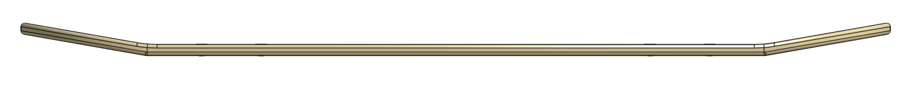
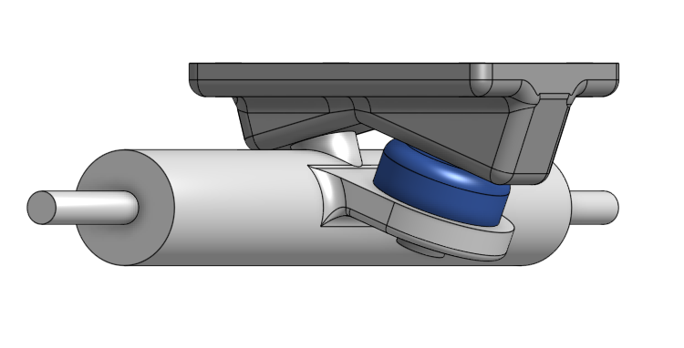

# AdvancedCAD
## Skateboard 
### Assginment
Create a skateboard, and all the parts required to make it, in OnShape by following the given directions.
#### Entire Board

##### Entire Board Reflection
While I was pretty much told what to do at all times do to the instuctions that were very helpful, I did learn a couple new things that will probably be helpful in the future, one of those things was the split tool. The split tool allowed me to make a singular line cut and split the part in two. The other main thing that i was taught in this assignment was the move face tool. The move face tool is not very complicated at all and is really just a transfrom tool but shifting a face in a different direction, which is really nice to have.
#### 2.1 Deck

The deck part of this Project was the easiest part of the three. The bending of the deck using the split tool was fun and something that I now know how to do and will use it more in the future.

#### 2.2 Trucks

Making the trucks was quite simple if you just follow what the instructions tell you to do, when the trucks were changed it was also pretty easy to follow except for one part. The one time that I got stuck was when I changed something but something broke and it didn't break in the instuctions so I had to just figure it out myself.

#### 2.3 Wheel and Bearing

The wheel and the bearing was one of easier part to make, because all that had to be done was a sketch with a lot of weird, but somewhat easy to follow dimensions, but the had to be esxact so that they would fit on the trucks. Next the sketch was revolved around a center line. The things to take away for the future, was reminding myself how to do a revolve, and using the hole that was made with the revolve, and just extruding that out to make the bearing, and finally making a very quick shell to make a indention on the bearing to make it look more like a bearing.
#### 2.4 Putting it all Together

During the consturction of the whole board I learned of a couple new ways to do things. Firstly I learned of the replicate tool, i had never used this tool before but I plan on using it in the future. The replicate tool allowed me to take one part, usually a bolt or nut of some kind, and then it allowed me to place it in every available place like the first place it was placed. Another thing that was very helpful was snap mode which I used to place the nuts and bolts with out having to insert each and everyone of them over and over again, when if I used the snap tool I can insert all of them, into the right places, all with one insert.
