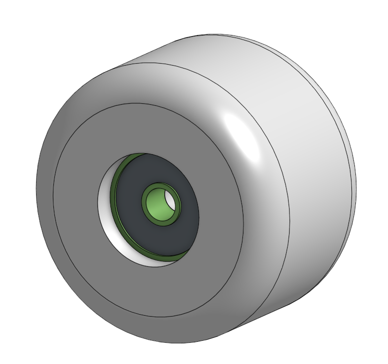

# AdvancedCAD
## Skateboard 
### Assginment
Create a skateboard, and all the parts required to make it, in OnShape by following the given directions.
#### Entire Board

##### Entire Board Reflection
While I was pretty much told what to do at all times do to the instuctions that were very helpful, I did learn a couple new things that will probably be helpful in the future, one of those things was the split tool. The split tool allowed me to make a singular line cut and split the part in two. The other main thing that i was taught in this assignment was the move face tool. The move face tool is not very complicated at all and is really just a transfrom tool but shifting a face in a different direction, which is really nice to have.
#### 2.1 Deck

The deck part of this Project was the easiest part of the three. The bending of the deck using the split tool was fun and something that I now know how to do and will use it more in the future.

#### 2.2 Trucks

Making the trucks was quite simple if you just follow what the instructions tell you to do, when the trucks were changed it was also pretty easy to follow except for one part. The one time that I got stuck was when I changed something but something broke and it didn't break in the instuctions so I had to just figure it out myself.

#### 2.3 Wheel and Bearing

The wheel and the bearing was one of easier part to make, because all that had to be done was a sketch with a lot of weird, but somewhat easy to follow dimensions, but the had to be esxact so that they would fit on the trucks. Next the sketch was revolved around a center line. The things to take away for the future, was reminding myself how to do a revolve, and using the hole that was made with the revolve, and just extruding that out to make the bearing, and finally making a very quick shell to make a indention on the bearing to make it look more like a bearing.
#### 2.4 Putting it all Together

During the consturction of the whole board I learned of a couple new ways to do things. Firstly I learned of the replicate tool, i had never used this tool before but I plan on using it in the future. The replicate tool allowed me to take one part, usually a bolt or nut of some kind, and then it allowed me to place it in every available place like the first place it was placed. Another thing that was very helpful was snap mode which I used to place the nuts and bolts with out having to insert each and everyone of them over and over again, when if I used the snap tool I can insert all of them, into the right places, all with one insert.

## Duck
### Assignment
Create a Lego Brick and then make enough configurations to be able to build a duck out of those Legos
#### 3.1 Lego Brick

##### Reflection
One thing that is useful taht we used during this part creation, and that was the shell feature. the sheel feature allows you to take a part that you have already made, and shell out the piece from one side and decide how thick the sides are. the second thing that happened here was adding new features ability. this ability makes it so some one can make an unoffical feature, and you can just take that feauture and add it to your onshape so you can do it in your own creations later. 

#### 3.2 Lego Brick Confiurations 

Configuration table for the size of the Lego brick

Configuration table for the block type of the Lego brick

Configuration table for the color of the Lego brick
##### Reflection
Configuratations are some of the more useful things, because it allows you to make a different version of your part by supressing some features, and potentially adding more features.

#### 3.3 Assembled Duck

##### Reflection
Snap mode. Its just one of the more simpler tools to use, but so incredibly useful. Snap mode allows you to snap two mate connectors together very easily.

#### 3.4 Duck Drawing

Base duck drawing 

Exploded drawing of the duck
##### Reflection
Drawings are a pretty knew thing ad a little odd, so just remember that drawing are useful because if you do the right drawing and display it correctly it will allow you/the person looking at the drawing to see the bricks more clearly and where they are placed. Another thing that is very useful is a BOM table, because it allows you to display what parts, bricks in this assignment, are used in this assembly and it shows the right amount of pieces.
## Multi-Tool
### Assignment
Create a Multi-Tool, from the dimensions given, that can work as a wrench, protractor, and a straightedge with inches and centimeter increments.
#### Multi-Tool 1

#### Reflection
Nothing special happened in this part of the Multi-Tool except for one feature that I havent really used before, the Sketch-Fillet. The Sketch Fillet is the exact same as the normal fillet, except that you do it in a sketch. The way you use it is by pressing a corner with the sketch fillet clicked and it will creat an arc with the two lines that made the corner, and then all you have to do it is to change the value of the fillet and then you are done.

#### Multi-Tool 2

#### Reflection
Creating the Drawing of the Multi-tool was simple, all I had to do was create a drawing tab, and click the insert button, and then click my multi-tool and drag it in, making sure it was in the right orientation and was in the right aspect ratio. After all of that all i had to do was drag it up into the right corner, draw some lines so that it will make the scrap left over more usable. and then export the file and put it in the "Print me" google drive.

#### Multi-Tool 3

#### Reflection
In this section of the assignment we were told that we forgot to add the wrench, so we made an assembly, and added a nut -1.85 mm on the x, and 7.5 mm on the y from the bottom right corner of the multi-tool. Then we edit the multi-tool in context to that mate that we have with the nut and remove the part of the multi-tool behind it, then we update the drawing and export it again and then put it in the drive and go over to the laser cutter, where we download the drawing onto the laser cutter computer. Then select that drawing on the laser cutter program, move it over to the top right corner and then find a good piece of acrylic then turn on the BOFA fan, and finally select the what you are cutting and the width of the material, then cut.
